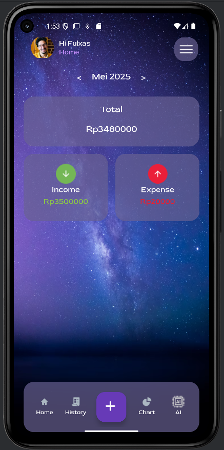
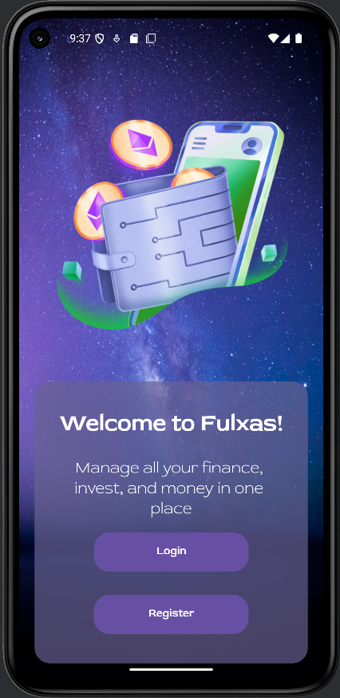
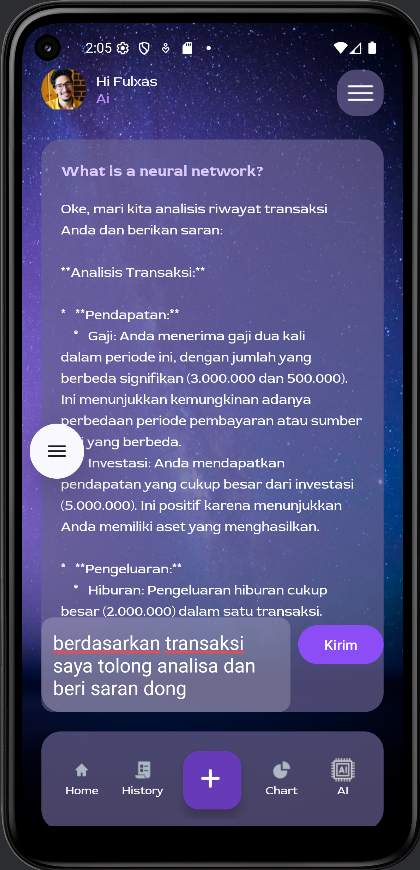
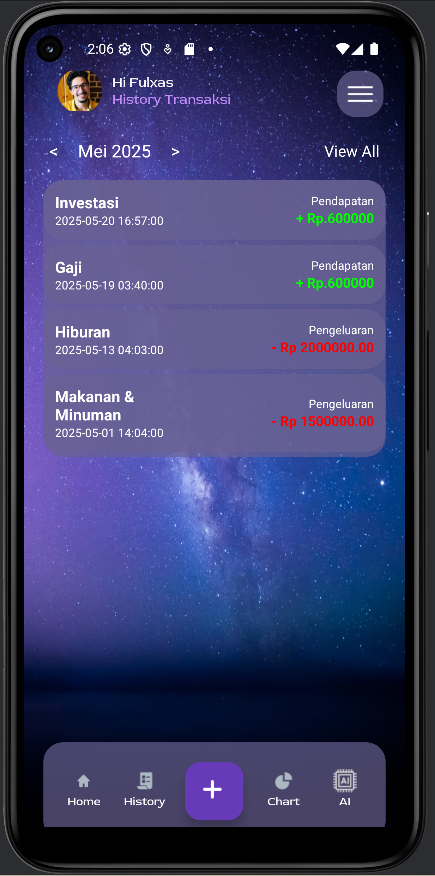
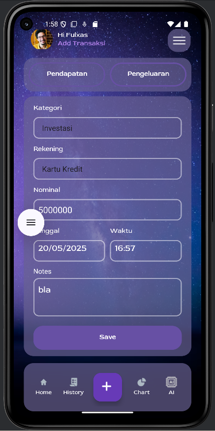
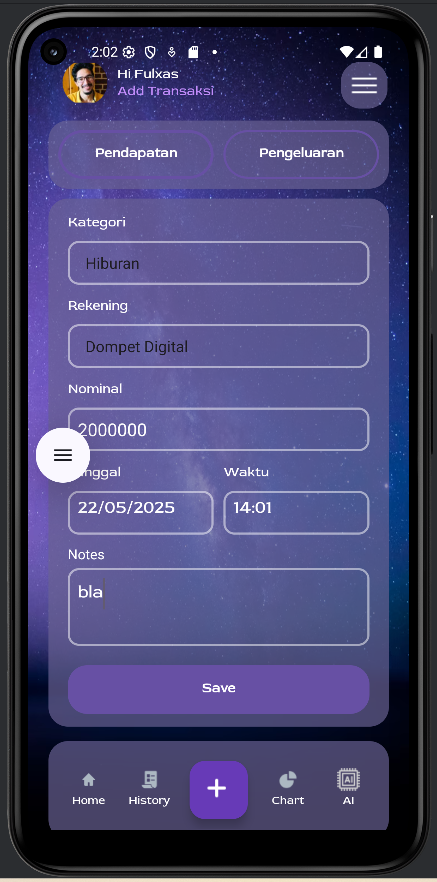
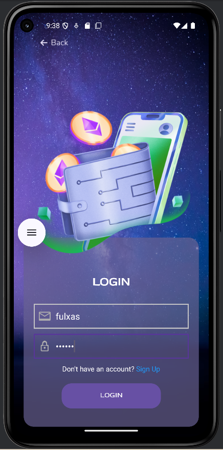
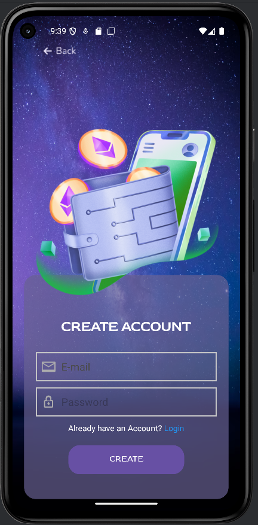
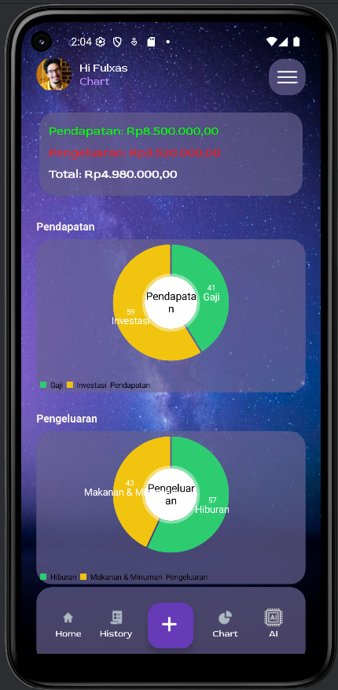

# Fulxas

**Fulxas** adalah aplikasi mobile Android untuk manajemen keuangan pribadi yang menggabungkan pencatatan keuangan harian dengan analisis berbasis AI. Dengan antarmuka modern dan integrasi berita ekonomi global, Fulxas hadir sebagai solusi pintar dalam mengelola dan memahami kondisi finansial pengguna.

## ✨ Fitur Utama

- ✅ **Pencatatan Keuangan Harian**  
  Catat semua pemasukan dan pengeluaran secara efisien.

- 🧠 **Analisis Keuangan Berbasis AI**  
  Evaluasi kondisi keuangan pribadi Anda melalui algoritma cerdas.

- 💡 **Rekomendasi Keuangan Pintar**  
  Dapatkan saran finansial berdasarkan kebiasaan dan histori Anda.

- 📊 **Chart Visualisasi Keuangan**  
  Lihat data keuangan Anda dalam bentuk grafik yang mudah dipahami.

- 🌐 **Integrasi Berita Ekonomi & Finansial Global**  
  Update terus dengan kondisi pasar melalui feed berita terkini.

- 🎨 **UI/UX Modern dan Responsif**  
  Tampilan yang nyaman, ringan, dan mudah digunakan.

## 📁 Struktur Layar Aplikasi

- `home.png` — Tampilan utama aplikasi
- `login.png` — Halaman login
- `register.png` — Halaman registrasi pengguna
- `main.png` — Dashboard ringkasan keuangan
- `pendapatan.png` — Input transaksi pemasukan
- `pengeluaran.png` — Input transaksi pengeluaran
- `history.png` — Riwayat transaksi
- `ai.png` — Fitur analisis AI
- `chart.png` — Visualisasi grafik keuangan
- `viewall.png` — Lihat semua transaksi

## ⚙️ Instalasi & Menjalankan Aplikasi

1. **Clone repositori ini:**
   ```bash
   git clone https://github.com/username/Fulxas.git
   cd Fulxas

2. **Buka di Android Studio:**
   - Pilih *"Open an existing project"* dari menu utama Android Studio
   - Arahkan ke folder `Fulxas/` hasil clone

3. **Jalankan aplikasi:**
   - Pilih emulator atau hubungkan perangkat Android
   - Klik tombol `Run` ▶️ untuk membangun dan menjalankan aplikasi

> Pastikan Anda telah menginstal Android Studio dan Android SDK yang sesuai.

## 🛠 Teknologi yang Digunakan

- **Bahasa:** Java (disesuaikan dengan source code)
- **Platform:** Android Native
- **UI Framework:** XML Layout + Material Design
- **API Eksternal:** REST API untuk berita ekonomi global & model AI lokal untuk analisis keuangan

## 📸 StoryBoard

Berikut beberapa tampilan dari aplikasi Fulxas:

| Beranda | Dashboard | AI |
|--------|-----------|----|
|  |  |  |

| Transaksi | Pemasukan | Pengeluaran |
|-----------|-----------|-------------|
|  |  |  |

| Login | Register | Grafik |
|-------|----------|--------|
|  |  |  |

## 👨‍💻 Tim Pengembang

- **Muhammad Ilham Firdaus**  
  Pengembang FrontEnd proyek Fulxas.
  - **Indra Maha Resi**  
  Pengembang BackEnd proyek Fulxas.
  - **Alisya Katsulya Tsaukani**  
  Pengembang UI/UX proyek Fulxas.

## 🤝 Kontribusi

Kami terbuka untuk kontribusi dari developer lain. Jika Anda ingin membantu pengembangan Fulxas:

1. Fork repositori ini
2. Buat branch baru: `git checkout -b fitur-anda`
3. Commit perubahan Anda: `git commit -m 'Tambah fitur baru'`
4. Push ke branch Anda: `git push origin fitur-anda`
5. Buat Pull Request ke repositori utama

## 📄 Lisensi

Proyek ini dilisensikan di bawah MIT License. Silakan lihat file `LICENSE` untuk informasi selengkapnya.

---

Terima kasih telah menggunakan Fulxas!  
Ingin bantu mengembangkan? Kami menunggu kontribusi Anda. 🚀
